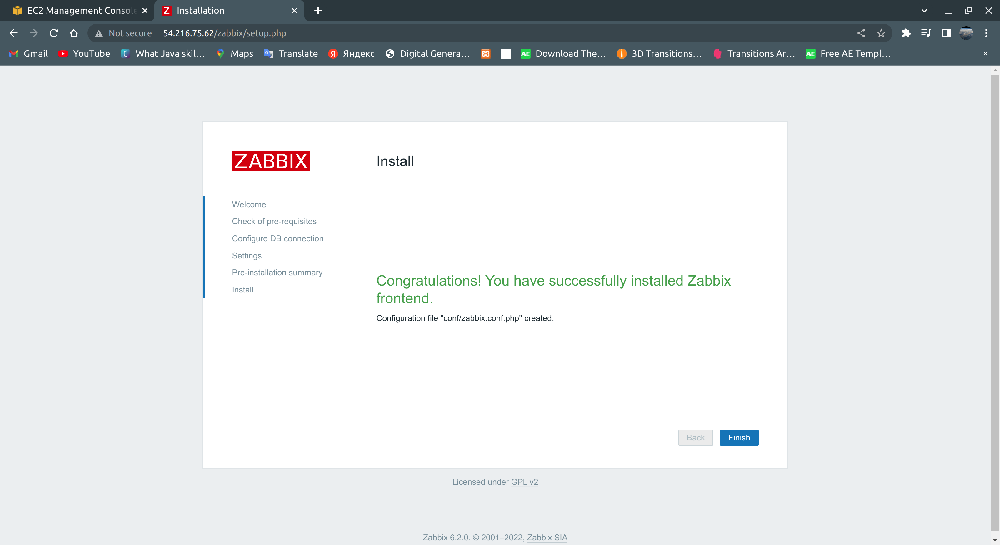
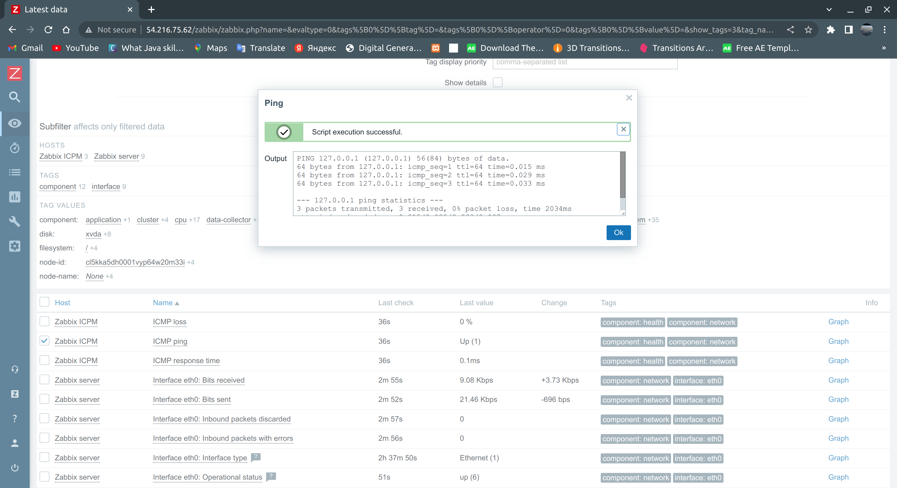

# Task 7: Logging & Monitoring

## Task 1: Zabbix
<pre>
Big brother is watching  ....
1.1 Install on server, configure web and base
1.2 Prepare VM or instances. 
1.2.1 Install Zabbix agents on previously prepared servers or VM.
EXTRA 1.2.2: Complete 1.2.1 using ansible
1.3 Make several of your own dashboards, where to output data from your host/vm/container (one of them)
1.4 Active check vs passive check - use both types.
1.5 Make an agentless check of any resource (ICMP ping)
1.6 Provoke an alert - and create a Maintenance instruction
1.7 Set up a dashboard with infrastructure nodes and monitoring of hosts and software installed on them
</pre>

## Big brother is watching ....

### Firstly I created EC2 Ubuntu instance in AWS

### I connected to EC2 instance and installed Zabbix Repository:

<pre>
wget https://repo.zabbix.com/zabbix/6.2/ubuntu/pool/main/z/zabbix-release/zabbix-release_6.2-1+ubuntu20.04_all.deb
sudo dpkg -i zabbix-release_6.2-1+ubuntu20.04_all.deb
sudo apt update
</pre>

### I installed Zabbix server, frontend, agent:
<pre>
sudo apt install zabbix-server-mysql zabbix-frontend-php zabbix-apache-conf zabbix-sql-scripts zabbix-agent
</pre>

### I installed MariaDB

<pre>
sudo apt install software-properties-common -y
curl -LsS -O https://downloads.mariadb.com/MariaDB/mariadb_repo_setup
sudo bash mariadb_repo_setup --mariadb-server-version=10.6
sudo apt update
sudo apt -y install mariadb-common mariadb-server-10.6 mariadb-client-10.6
sudo systemctl start mariadb
sudo systemctl enable mariadb
</pre>

### Next, I will need to create a database and user for Zabbix. First, I log into the MariaDB shell with the following command:

</pre>
sudo mysql -uroot -p
</pre>

### Once I login, I created create a database and user:

<pre>
CREATE DATABASE zabbix character set utf8mb4 collate utf8mb4_bin;
CREATE USER zabbix@localhost identified by 'Zabbix@1234';
</pre>

### Next, I grant all the privileges to the zabbixdb with the following command:
<pre>
GRANT ALL PRIVILEGES ON zabbix.* to zabbix@localhost WITH GRANT OPTION;
</pre>

### Next, flush the privileges and exit from the MariaDB shell with the following command:

<pre>
FLUSH PRIVILEGES;
EXIT;
</pre>

### Next on Zabbix server host I imported initial schema and data
<pre>
sudo zcat /usr/share/doc/zabbix-sql-scripts/mysql/server.sql.gz | mysql -uzabbix -p zabbix
</pre>

### Next, I edited the Zabbix default configuration file and define the database settings:

<pre>
sudo nano /etc/zabbix/zabbix_server.conf
</pre>

### I changed the following lines:

<pre>
DBPassword=Zabbix@1234
</pre>

### I saved and closed the file then started the Zabbix and Apache service with the following command:

<pre>
sudo systemctl start zabbix-server
sudo systemctl start apache2
</pre>

### I configured Web frotend by using url address: http://54.216.75.62/zabbix/setup.php

### I installed Zabbix Agent with the following commnad:

<pre>
sudo apt install zabbix-agent
sudo service zabbix-agent start
</pre>

### I edited Zabbix config file to create secure connection to Zabbix Server:
<pre>
sudo nano /etc/zabbix/zabbix_agentd.conf
</pre>

<pre>
Server=54.216.75.62
ServerActive=54.216.75.62
Hostname=Zabbix Ubuntu Server
TLSConnect=psk
TLSAccept=psk
TLSPSKIdentity=PSK 001
TLSPSKFile=/etc/zabbix/zabbix_agentd.psk
</pre>

<pre>
sudo systemctl restart zabbix-agent
sudo systemctl enable zabbix-agent
sudo ufw allow 10050/tcp
</pre>

### I created MyDashboard and added widgets: Clock, Data Overview, Map; Graph, Zabbix Server: Cpu utilization, Host avaialability, Problems.

### I generated PSK and saved for future use to configure host

### Active check vs passive check - use both types.

#### PASSIVE - ZABBIX SERVER (poller) -> AGENT (1050/TCP)
#### ACTIVE - AGENT -> ZABBIX SERVER (trapper) (1051/TC)

<h3>The additional benefit of the active checks is that the agent has a memory buffer for those checks. This means that you won't lose the data in case of a network issue. Using passive checks means that you cannot use the buffer.</h3>

### Agent Configuration

#### When configuring passive checks in zabbix_agentd.conf, we only need to change one parameter Server.

### Make an agentless check of any resource (ICMP ping)

### I Firstly I installed fping and configured zabbix_server.conf.

### Zabbix uses the fping utility for ICMP checks

<pre>
FpingLocation=/usr/bin/fping
Fping6Location=/usr/bin/fping6
</pre>

### Web panel --> Configuration --> Hosts, add new host with ICMP Ping template

### From Monitoring --> Latest Data you can get information about last value and last check. Also execute ping command.

### Provoke an alert - and create a Maintenance instruction
<h3>
Go to: Configuration → Maintenance
Click on Create maintenance period (or on the name of an existing maintenance period)
Enter maintenance parameters in the form
<h3>

### From Triger action i created new action:

### Set up a dashboard with infrastructure nodes and monitoring of hosts and software installed on them

## Task 2: ELK
<pre>
2. ELK:
Nobody is forgotten and nothing is forgotten.
2.1 Install and configure ELK
2.2 Organize collection of logs from docker to ELK and receive data from running containers
2.3 Customize your dashboards in ELK
EXTRA 2.4: Set up filter (get log messages from container by docker container name or docker image fields)*
2.5 Configure monitoring in ELK, get metrics from your running containers
2.6 Study features and settings
</pre>

## Nobody is forgotten and nothing is forgotten.

### Step 1: Create a Directory /Folder with the name of ELK.

### Step 2: Create a File named docker-compose.yml in this directory.

### Step 3: In docker-compose.yml the dependencies we want to install, including Elastic Search and Kibana)

<pre>
version: "3.7"
services:
  elasticsearch:
    image: docker.elastic.co/elasticsearch/elasticsearch:8.3.0
    container_name: elasticsearch
    restart: always
    environment:
      - xpack.security.enabled=false
      - discovery.type=single-node
    ulimits: 
      memlock:
        soft: -1 
        hard: -1
      nofile:
        soft: 65536
        hard: 65536
    cap_add: 
      - IPC_LOCK
    volumes:
      - elasticsearch-data-volume:/usr/share/elasticsearch/data
    ports:
      - "9200:9200"
  kibana:
    container_name: kibana
    image: docker.elastic.co/kibana/kibana:7.12.0
    restart: always
    environment:
      SERVER_NAME: kibana
      ELASTICSEARCH_HOSTS: http://elasticsearch:9200
    ports:
      - "5601:5601"
    depends_on:
      - elasticsearch
volumes: 
  elasticsearch-data-volume:
    driver: local
</pre>

### Step 4: Save the File and run the following command under the same directory terminal.

<pre>
docker-compose -f docker-compose.yml up -d
</pre>

### Go to http://localhost:9200/ (localhost server we provided for Kibana) and http://localhost:5601/( Elasticsearch host server) to check if its working fine.

We will get something like this on 9200:

### Organize collection of logs from docker to ELK and receive data from running container

<pre>
sudo docker run -d --name="logspout" --volume=/var/run/docker.sock:/var/run/docker.sock gliderlabs/logspout syslog+tls://:5000
</pre>

### Customize your dashboards in ELK

### Configure monitoring in ELK, get metrics from your running containers

### I will Collect Kibana monitoring data with Metricbeatedit

### Firstly I pulled Metricbeat image

<pre>
docker pull docker.elastic.co/beats/metricbeat:8.3.2
</pre>

### Run the Metricbeat setup

<pre>
docker run \
docker.elastic.co/beats/metricbeat:8.3.2 \
setup -E setup.kibana.host=kibana:5601 \
-E output.elasticsearch.hosts=["http://192.168.0.110:9200"]
</pre>

### Configure Metricbat on Docker

### Configuration file
<pre>
curl -L -O https://raw.githubusercontent.com/elastic/beats/8.3/deploy/docker/metricbeat.docker.yml
</pre>

### Volume-mounted configuration

<pre>
docker run -d \
  --name=metricbeat \
  --user=root \
  --volume="$(pwd)/metricbeat.docker.yml:/usr/share/metricbeat/metricbeat.yml:ro" \
  --volume="/var/run/docker.sock:/var/run/docker.sock:ro" \
  --volume="/sys/fs/cgroup:/hostfs/sys/fs/cgroup:ro" \
  --volume="/proc:/hostfs/proc:ro" \
  --volume="/:/hostfs:ro" \
  docker.elastic.co/beats/metricbeat:8.3.2 metricbeat -e \
  -E output.elasticsearch.hosts=["http://192.168.0.110:9200"]
</pre>

### I learned features and settings through the following webiste: 
<pre>https://logz.io/learn/complete-guide-elk-stack/</pre>

## Task 3: Grafana

<pre>
3.1 Install Grafana
3.2 Integrate with installed ELK
3.3 Set up Dashboards
3.4 Study features and settings
</pre>

### I installed Grafana in docker with the following command
<pre>
docker run -d --name=grafana -p 3000:3000 grafana/grafana
</pre>

### In order to integrate  installed ELK I installed ELK plugin

